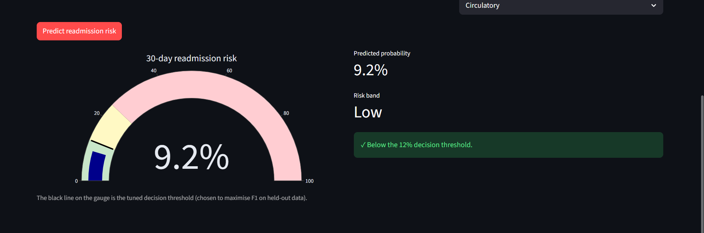

# 🏥 Hospital Readmission Risk — an end-to-end ML system

Predicting whether a diabetic patient will be **readmitted to hospital within 30
days** of discharge, from a real dataset of **100,000+ US hospital encounters**.

This project is built as a **complete, production-style machine-learning system** —
not a notebook. It covers the full lifecycle: raw data → cleaning → feature
engineering → tracked model training → honest evaluation → a served REST API → a
containerised deployment → a live interactive app → drift monitoring.

> **🔗 Live demo:** https://tarun-readmission-risk.streamlit.app
> **📊 Experiment tracking, REST API, Docker, CI, monitoring** — all included.


*The live Streamlit app: enter a patient's details and get a **calibrated** readmission
probability, shown against the decision threshold tuned on held-out data.*

---

## What I set out to do

Most of my earlier work lived in notebooks, and I knew that to move toward a data-scientist
role I had to show I could actually ship a model, not just train one. So I set myself a harder
challenge: take a real, messy healthcare problem — predicting whether a diabetic patient is
readmitted within 30 days of discharge — and build it the way it would actually exist in
production.

That meant doing every stage myself and being careful where it counts. I cleaned the data with
leakage in mind (the same patient shows up many times, so I kept only their first encounter),
engineered the features, tuned the models with Bayesian optimization, calibrated the
probabilities so a "10%" really means 10%, tracked the experiments in MLflow, served the model
through a FastAPI endpoint, containerised it with Docker, added tests and CI, deployed a live
Streamlit app, and set up drift monitoring.

**How it turned out:** the system side came together fully — it's live and you can try it. On
the prediction side I made a point of staying honest: the ROC-AUC lands around 0.66, which is
right in line with published results on this dataset because readmission is genuinely hard to
predict. I'd rather show a model that's good at ranking who's most at risk than dress it up as
something it isn't.

---

## Why this problem matters

I picked this problem because it's real, not toy. Unplanned 30-day readmissions
are a big cost and quality problem in healthcare, and hospitals get financially
penalised for them. If you can flag the patients most likely to bounce back, you
can point follow-up care (calls, medication review, home visits) at the people who
need it most. That's an actual deployed use-case for machine learning — and it's a
genuinely **hard** prediction problem, which is part of why I wanted to take it on.

## Headline results (honest)

| | |
|---|---|
| Best model | **XGBoost** (chosen on validation; vs LogReg, RF, LightGBM) |
| ROC-AUC (held-out test) | **0.658** (95% CI 0.642–0.675) |
| PR-AUC | **0.193** (≈ 2× the 9% base rate) |
| Probabilities | **calibrated** (isotonic) — a "10%" really means ~10% |
| Decision threshold | **0.121**, tuned on *validation* (not test) |

**Readmission is intrinsically hard to predict.** Published studies on this
dataset report ROC-AUC around **0.64–0.68**, and this system sits squarely in that
range. The value here is in *ranking* who is most at risk, not in perfect
prediction. I'd rather report that honestly than over-claim, and the app says the
same thing to anyone who uses it.

---

## Architecture

```
data download ──► cleaning ──► feature engineering ──► model training
 (UCI API)      (leakage &     (ICD-9 grouping,     (4 models, Bayesian-tuned,
                label fixes)    derived features)     calibrated, 5-fold CV)
                                                              │
                                                   MLflow experiment tracking
                                                   + model registry
                                                              │
                              ┌───────────────────────────────┴───────────────┐
                       FastAPI /predict service              Streamlit demo app
                       (validated REST API)                  (live, clickable)
                              │                                      │
                       Docker container                     Streamlit Community Cloud
                              │
              pytest  +  GitHub Actions CI  +  PSI data-drift monitor
```

## Tech stack

| Layer | Tools |
|---|---|
| Data & modelling | pandas, scikit-learn, **XGBoost**, **LightGBM** |
| Hyperparameter tuning | **scikit-optimize** (`BayesSearchCV`, Bayesian optimisation) |
| Statistics | scipy (Friedman + Wilcoxon-Holm model comparison; VIF) |
| Experiment tracking | **MLflow** (params, metrics, model registry) |
| Model serving | **FastAPI** + Pydantic validation, Uvicorn |
| Packaging | **Docker** |
| Testing & CI | **pytest** + **GitHub Actions** |
| App | **Streamlit** + Plotly |
| Monitoring | Population Stability Index (PSI) drift report |

---

## What makes this a *data-scientist* project (not just analysis)

1. **Leakage control.** The same patients show up many times, so I keep only each
   patient's **first encounter**. That alone removed **29,353 leaking rows** (~30%
   of the data) that would otherwise have inflated the score. (This follows the
   methodology of Strack et al., 2014.)
2. **Label-contamination fix.** I drop encounters ending in **death or hospice** —
   those patients can't be readmitted, so leaving them in poisons the target.
3. **Real feature engineering.** I grouped the 700+ raw ICD-9 diagnosis codes into
   **9 clinical categories**, and added a few derived features
   (`total_prior_visits`, `num_med_changes`) to capture clinical intuition.
4. **Imbalanced-learning done right.** The positive class is only ~9%. Instead of
   reweighting (which distorts the probabilities), I keep the natural
   probabilities, **calibrate** them (isotonic), deal with the imbalance through a
   **tuned decision threshold**, and report **threshold-independent metrics**
   (ROC-AUC, PR-AUC).
5. **Bayesian hyperparameter optimisation.** I search each model's hyperparameters
   with **scikit-optimize `BayesSearchCV`** (PR-AUC objective, fixed seed) — that's
   efficient and reproducible, rather than hand-picking defaults.
6. **Assumptions are checked, not assumed.** I verify the parametric requirements
   for logistic regression (independence, multicollinearity/VIF, events-per-
   variable) against the non-parametric tree models, and I compare the models
   **statistically** (Friedman + Wilcoxon-Holm) instead of eyeballing one number.
7. **Leakage-safe pipeline.** All encoding/scaling lives inside a scikit-learn
   `Pipeline` fitted on the training fold only, so cross-validation and serving
   stay honest.
8. **Reproducibility & MLOps.** Everything is config-driven, version-pinned,
   experiment-tracked, tested, containerised, CI-gated, and monitored for drift.

## Model comparison (selection on the validation set)

| Model | Validation ROC-AUC | Validation PR-AUC |
|---|---|---|
| **XGBoost** ✅ | **0.658** | **0.181** |
| LightGBM | 0.657 | 0.181 |
| Random Forest | 0.653 | 0.178 |
| Logistic Regression | 0.643 | 0.164 |

I select XGBoost on the **validation** set (by PR-AUC), then evaluate it **once**
on the untouched test set: **ROC-AUC 0.658 (95% CI 0.642–0.675)**. A Friedman test
across the cross-validation folds does pick up *some* difference among the four
(χ²=10.7, **p=0.014**), but that's driven almost entirely by **logistic regression
lagging**. The three tree models are statistically indistinguishable from each
other — every pairwise Wilcoxon–Holm comparison is non-significant (XGBoost vs
LightGBM p=1.0). So when I say "XGBoost is best", it's a mild preference over
LightGBM/RF, not a strong claim, and I'd rather say that plainly than oversell it.

## Methodology & rigor (how leakage is avoided)

I was deliberately strict about evaluation honesty, because it's the easiest place
to fool yourself:

- **Three-way split — train / validation / test.** I *fit* on train, *select* on
  validation, and *tune* the threshold on validation. The test set gets touched
  **exactly once**, at the very end, so its numbers are unbiased.
- **No threshold tuning on test, no model selection on test.** Both are common
  silent leaks that inflate reported scores, so I keep both on validation.
- **Calibrated probabilities.** Isotonic calibration (5-fold) means the predicted
  probabilities are trustworthy, not just rank-ordered — which matters because the
  app shows an actual probability to the user.
- **Bootstrap 95% confidence intervals** on the test metrics, so I report claims
  with their uncertainty (and show the competing models to be statistically close).
- **Bayesian hyperparameter optimisation** (`BayesSearchCV`, PR-AUC objective)
  tunes each model via cross-validation **inside the training set only** — the
  search never sees validation or test data. I deliberately leave
  `scale_pos_weight`/class weights out of the search so the probabilities stay
  calibratable.
- **Model assumptions verified** (`python -m src.models.diagnostics`): I check
  logistic regression's parametric assumptions (independence — engineered via
  first-encounter dedup; VIF multicollinearity; events-per-variable), and document
  why the tree models are free of them. Then I compare the four models with a
  **Friedman test + Wilcoxon-Holm** post-hoc — which I treat as illustrative,
  given it's a single dataset.
- **Leakage-safe feature pipeline** — all encoding/scaling is fit inside the
  scikit-learn `Pipeline` on training folds only.

---

## Project structure

```
hospital-readmission-risk/
├── config/config.yaml          # all settings in one place
├── src/
│   ├── config.py               # config loader
│   ├── data/
│   │   ├── download.py         # download + audit raw data
│   │   └── preprocess.py       # cleaning, leakage/label fixes, target
│   ├── features/build_features.py  # ICD-9 grouping + derived features
│   ├── models/
│   │   ├── pipeline.py         # split + leakage-safe preprocessing
│   │   ├── train.py            # Bayesian-tune 4 models, calibrate, MLflow + registry
│   │   ├── diagnostics.py      # assumption checks + Friedman/Wilcoxon comparison
│   │   └── evaluate.py         # honest test report + diagnostic plots
│   ├── api/main.py             # FastAPI /predict service
│   └── monitoring/drift.py     # PSI data-drift monitor
├── app/streamlit_app.py        # interactive demo
├── tests/test_features.py      # pytest unit tests
├── .github/workflows/ci.yml    # GitHub Actions CI
├── Dockerfile                  # containerised API
├── requirements.txt            # full pinned deps
└── README.md
```

## How to reproduce

```bash
# 1. install
pip install -r requirements.txt

# 2. run the pipeline (each step prints what it does)
python -m src.data.download            # download + audit raw data
python -m src.features.build_features   # clean + engineer features
python -m src.models.train              # Bayesian-tune 4 models, calibrate, log to MLflow
python -m src.models.diagnostics        # assumption checks + statistical model comparison
python -m src.models.evaluate           # honest test report + save plots
python -m src.monitoring.drift          # data-drift report

# 3. view the tracked experiments
mlflow ui --backend-store-uri sqlite:///mlflow.db   # -> http://127.0.0.1:5000

# 4. serve the model as an API
uvicorn src.api.main:app --reload       # -> http://127.0.0.1:8000/docs

# 5. or run it in Docker
docker build -t readmission-api .
docker run -p 8000:8000 readmission-api

# 6. run the interactive app
streamlit run app/streamlit_app.py

# 7. run the tests
pytest -v
```

## Limitations & future work

- **Predictability ceiling.** ROC-AUC ~0.65 reflects how hard readmission is to
  predict from administrative data alone; richer clinical/lab/time-series data
  would help, but I didn't have it.
- **Single dataset, single era** (1999–2008, US hospitals), so external validity is
  limited. I'd re-validate and re-calibrate the model before trusting it anywhere
  real.
- **Not for clinical use.** This is a portfolio/educational project, not a
  validated medical device, and I want to be clear about that.
- **What I'd do next:** SHAP explanations per prediction, native categorical /
  target encoding, automated retraining when drift is detected, and deploying the
  API behind a proper cloud host.

## Data

UCI Machine Learning Repository — *Diabetes 130-US hospitals for years 1999–2008*.
Strack et al. (2014), *Impact of HbA1c Measurement on Hospital Readmission Rates*,
BioMed Research International.
```bash
python -m src.data.download   # fetches it automatically
```
